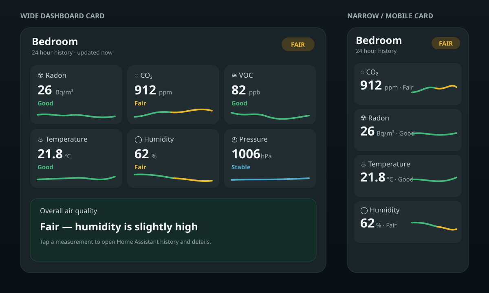

# Airthings Card

A responsive Home Assistant card for one Airthings device. Each measurement
combines its current value, health colour and recent history in one glance.

> **Status:** v0.3.1 preview. The YAML API can change before v1.0.

## Design goals

- One card per physical Airthings device.
- SVG history graphs that stay sharp at every dashboard size.
- Current values and graph segments share the same threshold colours.
- Responsive layout without horizontal scrolling.
- Home Assistant theme colours, entity dialogs and history API.
- Measurements are discovered from the selected Airthings device.

## Install with HACS

Until this repository is included in HACS defaults:

1. Open **HACS → Frontend**.
2. Add https://github.com/MEbsen/AIRTHINGS-Card as a custom repository with
   category **Dashboard**.
3. Install **Airthings Card** and reload the browser.

If HACS has not created the resource, add:

~~~text
/hacsfiles/AIRTHINGS-Card/airthings-card.js
~~~

Resource type: **JavaScript module**.

## First configuration

Add **Custom: Airthings Card** from Home Assistant's card picker. The card starts
without a preselected device. Choose one from the **Airthings device** radio list;
the list contains devices exposing supported air-quality sensors, and the card
then discovers their sensors automatically.
YAML remains available:

~~~yaml
type: custom:airthings-card
device_id: 0123456789abcdef
title: Bedroom # optional
hours: 24
~~~

The visual editor writes the device ID for you. Existing configurations using
the manual entities list remain supported as a fallback.

## Current preview

- Visual editor with an Airthings device radio list.
- Automatic Airthings sensor discovery through HA's device/entity registry.
- Model-dependent support for radon, PM2.5, PM1, CO₂, VOC, temperature,
  humidity, pressure, noise and light.
- Battery icon and exact percentage beside the device name.
- Stable measurement order across cards: radon, PM2.5, PM1, CO₂, VOC,
  temperature, humidity, pressure, noise and light. Unsupported measurements
  are skipped without changing the relative order of the remaining tiles.
- Responsive card and SVG sparklines.
- Automatic column count based on the width assigned by the dashboard layout.
- History from Home Assistant recorder API.
- Threshold colour on current value and individual graph segments.
- Measurement click opens the Home Assistant more-info dialog.
- Graceful unavailable sensor and missing history states.

## Default quality bands

The bands below control both the current-value colour and each SVG history
segment. They are display bands for quick comparison, not medical alarm limits.

| Measurement | Good | Fair | Poor | High |
| --- | ---: | ---: | ---: | ---: |
| Radon (Bq/m³) | `<100` | `100–199` | `200–299` | `≥300` |
| PM2.5 (µg/m³) | `<10` | `10–24.9` | `25–34.9` | `≥35` |
| PM1 (µg/m³) | `<10` | `10–24.9` | `25–34.9` | `≥35` |
| CO₂ (ppm) | `<800` | `800–999` | `1000–1399` | `≥1400` |
| VOC (ppb) | `<250` | `250–999` | `1000–1999` | `≥2000` |
| Temperature (°C) | `18–24.9` | `<18 or 25–27.9` | `≥28` | — |
| Humidity (%) | `40–59.9` | `30–39.9 or 60–69.9` | `<30 or ≥70` | — |
| Noise (dB) | `<55` | `55–69.9` | `70–84.9` | `≥85` |
| Pressure / light | Neutral current-value colour; no universal quality band |

PM2.5 follows Airthings' published good/fair boundary values; the extra red
band is a card display tier. PM1 temporarily follows the same display bands
because no separate broadly accepted indoor PM1 standard exists. Noise depends
strongly on room and time of day, while light and pressure are contextual, so
those readings should not be interpreted as health alarms.

## Planned before v1.0

- Editor controls for time range, thresholds and graph detail.
- Optional compact layout and per-device summary.
- Localised labels, including Danish.
- Desktop, tablet and mobile test matrix.

## Development

The preview is a dependency-free JavaScript module so HACS can load it directly.

~~~bash
npm run check
~~~
